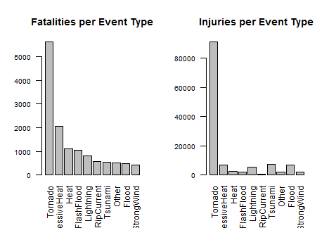
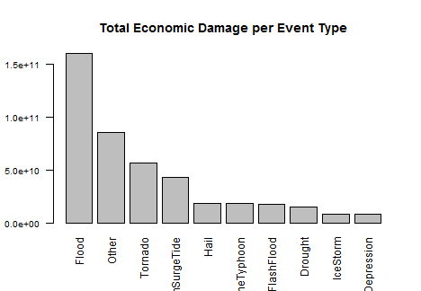

## Analysis of Storm Event Data for Public Health Impact and Economic Consequences

#### Vinay Vasudev


## Synopsis

The objective for this assignment is to explore a reproducible research analysis using a data set about severe weather events. Data set comes from the U.S. National Oceanic and Atmospheric Administration's (NOAA) storm database. This database tracks characteristics of major storms and weather events in the United States, including when and where they occur, as well as estimates of any fatalities, injuries, and property damage.The purpose of this assignment is to load, clean and prapare the data so that the following two questions can be addressed.

* Across the United States, which types of events (as indicated in the EVTYPE variable) are most harmful with respect to population health?

* Across the United States, which types of events have the greatest economic consequences?

The dataset is very large with almost a million record with the information which has not been coded consistently because of different practices over the last 40-50 years. All this proved to be very challenging in handling and cleaning the data to prepare for answering the above questions.

## Data Processing

We load the data directly from the source directory which is set in the code and the data is read directly from a zipped file (as downloaded from the course site) of a massive size (902297 observations of 37 variables: about 47 MB). After the data is loaded, we inspect various structural elements of the data set so that strategies can be devised for cleaning and preparation. We observe that the column "EVTYPE" which has detail about the recorded weather events stores the values as factors but because of spelling variations and several different special characters lot of potential duplicate names exist. We find that there are 985 different levels of factors with almost a million records.


```r
setwd("C:/Users/vasudev/Desktop/Data Science Specialization/Reproducible Research/Course Projects/PA_2")
Sys.setlocale("LC_ALL","English")
```

```
## [1] "LC_COLLATE=English_United States.1252;LC_CTYPE=English_United States.1252;LC_MONETARY=English_United States.1252;LC_NUMERIC=C;LC_TIME=English_United States.1252"
```

```r
stormData5Rows <- read.table("repdata-data-StormData.csv.bz2", header = TRUE, nrows = 5)
classes <- sapply(stormData5Rows, class)
stormData <- read.table("repdata-data-StormData.csv.bz2", sep = ",",
    header = TRUE, colClasses = classes)
```

```
## Warning: not all columns named in 'colClasses' exist
## Warning: number of items to replace is not a multiple of replacement length
```

```r
head(stormData)
```

```
##   STATE__           BGN_DATE BGN_TIME TIME_ZONE COUNTY COUNTYNAME STATE
## 1    1.00  4/18/1950 0:00:00     0130       CST     97     MOBILE    AL
## 2    1.00  4/18/1950 0:00:00     0145       CST      3    BALDWIN    AL
## 3    1.00  2/20/1951 0:00:00     1600       CST     57    FAYETTE    AL
## 4    1.00   6/8/1951 0:00:00     0900       CST     89    MADISON    AL
## 5    1.00 11/15/1951 0:00:00     1500       CST     43    CULLMAN    AL
## 6    1.00 11/15/1951 0:00:00     2000       CST     77 LAUDERDALE    AL
##    EVTYPE BGN_RANGE BGN_AZI BGN_LOCATI END_DATE END_TIME COUNTY_END
## 1 TORNADO         0                                               0
## 2 TORNADO         0                                               0
## 3 TORNADO         0                                               0
## 4 TORNADO         0                                               0
## 5 TORNADO         0                                               0
## 6 TORNADO         0                                               0
##   COUNTYENDN END_RANGE END_AZI END_LOCATI LENGTH WIDTH F MAG FATALITIES
## 1         NA         0                      14.0   100 3   0          0
## 2         NA         0                       2.0   150 2   0          0
## 3         NA         0                       0.1   123 2   0          0
## 4         NA         0                       0.0   100 2   0          0
## 5         NA         0                       0.0   150 2   0          0
## 6         NA         0                       1.5   177 2   0          0
##   INJURIES PROPDMG PROPDMGEXP CROPDMG CROPDMGEXP WFO STATEOFFIC ZONENAMES
## 1       15    25.0          K       0                                    
## 2        0     2.5          K       0                                    
## 3        2    25.0          K       0                                    
## 4        2     2.5          K       0                                    
## 5        2     2.5          K       0                                    
## 6        6     2.5          K       0                                    
##   LATITUDE LONGITUDE LATITUDE_E LONGITUDE_ REMARKS REFNUM
## 1     3040      8812       3051       8806              1
## 2     3042      8755          0          0              2
## 3     3340      8742          0          0              3
## 4     3458      8626          0          0              4
## 5     3412      8642          0          0              5
## 6     3450      8748          0          0              6
```

```r
str(stormData)
```

```
## 'data.frame':	902297 obs. of  37 variables:
##  $ STATE__   : Factor w/ 70 levels "1.00","10.00",..: 1 1 1 1 1 1 1 1 1 1 ...
##  $ BGN_DATE  : Factor w/ 16335 levels "1/1/1966 0:00:00",..: 6523 6523 4242 11116 2224 2224 2260 383 3980 3980 ...
##  $ BGN_TIME  : Factor w/ 3608 levels "00:00:00 AM",..: 272 287 2705 1683 2584 3186 242 1683 3186 3186 ...
##  $ TIME_ZONE : Factor w/ 22 levels "ADT","AKS","AST",..: 7 7 7 7 7 7 7 7 7 7 ...
##  $ COUNTY    : num  97 3 57 89 43 77 9 123 125 57 ...
##  $ COUNTYNAME: Factor w/ 29601 levels "","5NM E OF MACKINAC BRIDGE TO PRESQUE ISLE LT MI",..: 13513 1873 4598 10592 4372 10094 1973 23873 24418 4598 ...
##  $ STATE     : Factor w/ 72 levels "AK","AL","AM",..: 2 2 2 2 2 2 2 2 2 2 ...
##  $ EVTYPE    : Factor w/ 985 levels "   HIGH SURF ADVISORY",..: 834 834 834 834 834 834 834 834 834 834 ...
##  $ BGN_RANGE : num  0 0 0 0 0 0 0 0 0 0 ...
##  $ BGN_AZI   : Factor w/ 35 levels "","  N"," NW",..: 1 1 1 1 1 1 1 1 1 1 ...
##  $ BGN_LOCATI: Factor w/ 54429 levels "","- 1 N Albion",..: 1 1 1 1 1 1 1 1 1 1 ...
##  $ END_DATE  : Factor w/ 6663 levels "","1/1/1993 0:00:00",..: 1 1 1 1 1 1 1 1 1 1 ...
##  $ END_TIME  : Factor w/ 3647 levels ""," 0900CST",..: 1 1 1 1 1 1 1 1 1 1 ...
##  $ COUNTY_END: num  0 0 0 0 0 0 0 0 0 0 ...
##  $ COUNTYENDN: logi  NA NA NA NA NA NA ...
##  $ END_RANGE : num  0 0 0 0 0 0 0 0 0 0 ...
##  $ END_AZI   : Factor w/ 24 levels "","E","ENE","ESE",..: 1 1 1 1 1 1 1 1 1 1 ...
##  $ END_LOCATI: Factor w/ 34506 levels "","- .5 NNW",..: 1 1 1 1 1 1 1 1 1 1 ...
##  $ LENGTH    : num  14 2 0.1 0 0 1.5 1.5 0 3.3 2.3 ...
##  $ WIDTH     : num  100 150 123 100 150 177 33 33 100 100 ...
##  $ F         : int  3 2 2 2 2 2 2 1 3 3 ...
##  $ MAG       : num  0 0 0 0 0 0 0 0 0 0 ...
##  $ FATALITIES: num  0 0 0 0 0 0 0 0 1 0 ...
##  $ INJURIES  : num  15 0 2 2 2 6 1 0 14 0 ...
##  $ PROPDMG   : num  25 2.5 25 2.5 2.5 2.5 2.5 2.5 25 25 ...
##  $ PROPDMGEXP: Factor w/ 19 levels "","-","?","+",..: 17 17 17 17 17 17 17 17 17 17 ...
##  $ CROPDMG   : num  0 0 0 0 0 0 0 0 0 0 ...
##  $ CROPDMGEXP: Factor w/ 9 levels "","?","0","2",..: 1 1 1 1 1 1 1 1 1 1 ...
##  $ WFO       : Factor w/ 542 levels ""," CI","$AC",..: 1 1 1 1 1 1 1 1 1 1 ...
##  $ STATEOFFIC: Factor w/ 250 levels "","ALABAMA, Central",..: 1 1 1 1 1 1 1 1 1 1 ...
##  $ ZONENAMES : Factor w/ 25112 levels "","                                                                                                                               "| __truncated__,..: 1 1 1 1 1 1 1 1 1 1 ...
##  $ LATITUDE  : num  3040 3042 3340 3458 3412 ...
##  $ LONGITUDE : num  8812 8755 8742 8626 8642 ...
##  $ LATITUDE_E: num  3051 0 0 0 0 ...
##  $ LONGITUDE_: num  8806 0 0 0 0 ...
##  $ REMARKS   : Factor w/ 436781 levels "","-2 at Deer Park\n",..: 1 1 1 1 1 1 1 1 1 1 ...
##  $ REFNUM    : num  1 2 3 4 5 6 7 8 9 10 ...
```

After the data is loaded and the initial exploration is complete we create a subset of data set in a new data frame to carry forward only the required elements of data which will help us answer the questions for the assignment. This makes the data easier to load and handle. Number of observations are now reduced to 254633 but the number of factor levels for EVTYPE are still at 985.


```r
stormDataNew <- stormData[, c(8, 23:28)]
stormDataNew <-stormDataNew[(stormDataNew$PROPDMG > 0 |
    stormDataNew$CROPDMG > 0 | stormDataNew$FATALITIES > 0 |
    stormDataNew$INJURIES > 0), ]
```

Now we turn our attention to the column "EVTYPE" which requires significant amount of cleaning and removal duplicates and special characters. We also change all the character strings to lower case. Through this process we are able reduce number of factor levels from 985 to 397 which is a significant reduction. We also create a new column in the data frame "TYPE" which we use for storing the cleaned and standardized weather event labels. For now, we make an exact copy of what is in "EVTYPE" after cleanup.


```r
stormDataNew[, 'TYPE'] <- stormDataNew[, 'EVTYPE']
stormDataNew$TYPE <- gsub("[[:punct:]]"," ",stormDataNew$TYPE)
stormDataNew$TYPE <- gsub("[[:digit:]]","",stormDataNew$TYPE)
stormDataNew$TYPE <- gsub("(^ +)|( +$)", "", stormDataNew$TYPE)
stormDataNew$TYPE <- tolower(stormDataNew$TYPE)
stormDataNew[, 'TYPE'] <- as.factor(stormDataNew[, 'TYPE'])
```
During the initial exploration we had noticed that some variables in the data set stored exponent values for property damage and crop damage. These values were stored as factors and in many situations had characters which either did not make any sense, could not be identified, or in some cases had to be translated into equivalent number, e.g., K or k in field meant a multiplier by 1000. 

In the following section, we cleaned these fields and also created an additional column "FINDMG" to store the results of calculation to determine the total economic losses because of a severe weather event which essentially is sum total of property and crop damages.


```r
stormDataNew$PROPEXP <- factor(stormDataNew$PROPDMGEXP)
levels(stormDataNew$PROPEXP) <- list(
    "0" = c("", "-", "?", "+"),
    "100" = c("H", "h"),
    "1000" = c("K", "k"),
    "1000000" = c("M", "m"),
    "1000000000" = c("B", "b")
)

stormDataNew$CROPEXP <- factor(stormDataNew$CROPDMGEXP)
levels(stormDataNew$CROPEXP) <- list(
    "0" = c("", "?", "0"),
    "1000" = c("K", "k"),
    "1000000" = c("M", "m"),
    "1000000000" = c("B", "b")
)

stormDataNew$PROPEXP <- as.numeric(as.character(stormDataNew$PROPEXP))
stormDataNew$CROPEXP <- as.numeric(as.character(stormDataNew$CROPEXP))


stormDataNew$PROP <- (stormDataNew$PROPDMG * stormDataNew$PROPEXP)
stormDataNew$CROP <- (stormDataNew$CROPDMG * stormDataNew$CROPEXP)

stormDataNew$FINDMG <- (stormDataNew$PROP + stormDataNew$CROP)
```

Finally, we devise a strategy to further clean and reduce the weather event type labels data. We researched and determined that NOAA/NWS (National Weather Service directive 10-1605) has defined 48 categories of severe weather events leading to fatalities, injuries, damage, etc. This also includes significant events, such as tornadoes that have no impact or cause no damage are also included in the Storm Data.

For the purpose of this analysis, several of the summary reports were considered the duplicated records and were accumulated in "Other" category.

In the following section, we take event type data stored in the column "TYPE" (about 397 labels) and cross-match them with the 48 categories defined by NOAA/NWS. WIth this detailed cross-matching we are able to bring down the number of labels to 45. There were few labels which didn't fit the 48 categories so we grouped them together as "Other". This way we ensure that all the labels are accounted for and there are no column fields with missing values (or NAs). 


```r
levels(stormDataNew$TYPE) <- list(
    AstronomicalTide = c("astronomical high tide","astronomical low tide"),
    Avalanche = c("avalance", "avalanche"),
    Blizzard = c("blizzard","blizzardwinter storm","ground blizzard"),
    CoastalFlood = c("beach erosion","coastal erosion","coastal flood",
    "coastal flooding","coastal floodingerosion","erosioncstl flood",
    "heavy surf coastal flooding","coastal  floodingerosion"),
    ColdWindChill = c("cold","coldwind chill","coldwinds","cool and wet",
    "low temperature","unseasonable cold","unseasonably cold"),
    DenseFog = c("dense fog","fog","fog and cold temperatures"),
    DenseSmoke = c("dense smoke"),
    Drought = c("drought","droughtexcessive heat"),
    DustDevil = c("dust devil","dust devil waterspout"),
    DustStorm = c("blowing dust","dust storm","dust stormhigh winds"),
    ExcessiveHeat = c("excessive heat","extreme heat","hypothermia",
    "hypothermiaexposure","record heat","recordexcessive heat",
    "unseasonably warm","unseasonably warm and dry","warm weather"),
    ExtremeColdWindChill = c("cold air tornado","cold and snow",
    "cold and wet conditions","cold temperature","cold wave","cold weather",
    "extended cold","extreme cold","extreme coldwind chill","extreme wind chill",
    "extreme windchill","hyperthermiaexposure","record cold"),
    FlashFlood = c("breakup flooding","dam break","downburst","drowning",
    "flash flood","flash flood  heavy rain","flash flood from ice jams",
    "flash flood landslides","flash flood street","flash flood winds",
    "flash floodflood","flash flooding","flash floodingflood",
    "flash floodingthunderstorm wi","flash floodlandslide","flash floods",
    "flood  heavy rain","flood flash","floodflash","floodflash flood",
    "floodflashflood","landslide","landslides","landslump","landspout",
    "marine accident","marine mishap","mud slide","mud slides",
    "mud slides urban flooding","mudslide","mudslides","rapidly rising water"),
    Flood = c("flood","flooding","floodingheavy rain","floodrainwinds",
    "floodriver flood","floods","major flood","minor flooding",
    "river and stream flood","river flood","river flooding","rural flood",
    "small stream flood","tidal flooding","urban and small",
    "urban and small stream floodin","urban flood","urban flooding",
    "urban floods","urban small","urbansmall stream","urbansmall stream flood",
    "urbansml stream fld"),
    FreezingFog = c("light freezing rain"),
    FrostFreeze = c("agricultural freeze","black ice","damaging freeze",
    "early frost","falling snowice","freeze","freezing drizzle","freezing fog",
    "freezing rain","freezing rainsleet","freezing rainsnow","freezing spray",
    "frost","frostfreeze","glaze","glaze ice","hard freeze","light snow",
    "light snowfall"),
    FunnelCloud = c("funnel cloud"),
    Hail = c("hail","hail","hail damage","hailstorm","hailwind","hailwinds"),
    Heat = c("heat","heat wave","heat wave drought","heat waves"),
    HeavyRain = c("excessive rainfall","excessive wetness","heavy rain",
    "heavy rain and flood","heavy rainhigh surf","heavy rainlightning",
    "heavy rains","heavy rainsevere weather","heavy rainsflooding",
    "heavy rainsmall stream urban","heavy rainsnow","heavy shower","hvy rain",
    "rain","rainsnow","rainstorm","rainwind","record rainfall",
    "torrential rainfall","unseasonal rain"),
    HeavySnow = c("blowing snow","excessive snow","heavy mix",
    "heavy precipitation","heavy snow","heavy snow and high winds",
    "heavy snow and strong winds","heavy snow shower","heavy snow squalls",
    "heavy snowblizzard","heavy snowblizzardavalanche","heavy snowfreezing rain",
    "heavy snowhigh winds  flood","heavy snowice","heavy snowpack",
    "heavy snowsqualls","heavy snowwind","heavy snowwinter storm",
    "late season snow","mixed precip","mixed precipitation","record snow",
    "rock slide","snow","snow accumulation","snow and heavy snow","snow and ice",
    "snow and ice storm","snow bitter cold","snow freezing rain","snow ice",
    "snow squall","snow squalls","snowblowing snow","snowcold",
    "snowfreezing rain","snowheavy snow","snowhigh winds","snowice",
    "snowice storm","snowmelt flooding","snowsleet","snowsleetfreezing rain",
    "thundersnow"),
    HighSurf = c("hazardous surf"),
    HighWind = c("dry microburst","dry mircoburst winds","microburst",
    "microburst winds","nonsevere wind damage"),
    HurricaneTyphoon = c("hurricane","hurricane edouard","hurricane emily",
    "hurricane erin","hurricane felix","hurricane gordon","hurricane opal",
    "hurricane opalhigh winds","hurricanegenerated swells","hurricanetyphoon",
    "typhoon"),
    IceStorm = c("glazeice storm","ice","ice and snow","ice floes","ice jam",
    "ice jam flood minor","ice jam flooding","ice on road","ice roads",
    "ice storm","ice stormflash flood","icestrong winds","icy roads"),
    LakeEffectSnow = c("heavy lake snow","lake effect snow","lakeeffect snow"),
    LakeshoreFlood = c("lake flood","lakeshore flood"),
    Lightning = c("lighting","lightning","lightning  wauseon",
    "lightning and heavy rain", "lightning and thunderstorm win","lightning fire",
    "lightning injury","lightning thunderstorm winds","lightningheavy rain",
    "ligntning"),
    MarineHail = c("marine hail"),
    MarineHighWind = c("heavy seas","heavy surf","heavy surf and wind",
    "heavy surfhigh surf","heavy swells","marine high wind","marine tstm wind"),
    MarineThunderstormWind = c("marine strong wind","marine thunderstorm wind"),
    RipCurrent = c("rip current","rip currents","rip currentsheavy surf"),
    Seiche = c("seiche"),
    Sleet = c("sleet","sleetice storm","small hail"),
    StormSurgeTide = c("coastal storm","coastal surge","coastalstorm","high seas",
    "high surf","high surf advisory","high swells","high tides","high water",
    "high waves","rogue wave","rough seas","rough surf","storm force winds",
    "storm surge","storm surgetide"),
    StrongWind = c("gradient wind","gusty wind","gusty windhail",
    "gusty windhvy rain","gusty windrain","gusty winds","high","high  winds",
    "high wind","high wind","high wind and seas","high wind damage","high wind g",
    "high windblizzard","high windheavy snow","high winds",
    "high winds heavy rains","high windscoastal flood","high windscold",
    "high windseas","high windsheavy rain","high windssnow","non tstm wind",
    "nontstm wind","severe turbulence","strong wind","strong winds",
    "wet microburst","whirlwind","wind","wind and wave","wind damage",
    "wind storm","windhail","winds"),
    ThunderstormWind = c("severe thunderstorm","severe thunderstorm winds",
    "severe thunderstorms","thuderstorm winds","thundeerstorm winds",
    "thunderestorm winds","thunderstorm","thunderstorm  winds",
    "thunderstorm damage to","thunderstorm hail","thunderstorm wind",
    "thunderstorm wind  mph","thunderstorm wind g","thunderstorm wind mph",
    "thunderstorm wind tree","thunderstorm wind trees","thunderstorm windawning",
    "thunderstorm windhail","thunderstorm windlightning","thunderstorm winds",
    "thunderstorm winds","thunderstorm winds  mph","thunderstorm winds and",
    "thunderstorm winds flood","thunderstorm winds g","thunderstorm winds hail",
    "thunderstorm winds lightning","thunderstorm windsflooding","thunderstorm",
    " windsfunnel clou","thunderstorm windshail","thunderstorm windss",
    "thunderstorm wins","thunderstorms","thunderstorms wind",
    "thunderstorms winds","thunderstormw","thunderstormwinds","thunderstrom wind",
    "thundertorm winds","thunerstorm winds","tunderstorm wind"), 
    Tornado = c("gustnado","tornado","tornado f","tornadoes",
    "tornadoes tstm wind hail","torndao"),
    TropicalDepression = c("tropical depression","tropical storm",
    "tropical storm alberto","tropical storm dean","tropical storm gordon",
    "tropical storm jerry"),
    Tsunami = c("tstm wind","tstm wind","tstm wind  g","tstm wind and lightning",
    "tstm wind damage","tstm wind g","tstm windhail","tstm winds","tstmw",
    "tsunami"),
    VolcanicAsh = c("volcanic ash"),
    Waterspout = c("waterspout","waterspout tornado","waterspouttornado"),
    Wildfire = c("brush fire","forest fires","grass fires","wild fires",
    "wildfire","wildfires","wildforest fire","wildforest fires"),
    WinterStorm = c("winter storm","winter storm high winds","winter storms"),
    WinterWeather = c("winter weather","winter weather mix","winter weathermix",
    "wintry mix"),
    Other = c("apache county","other")
)

stormDataNew$TYPE[is.na(stormDataNew$TYPE)] <- as.factor("Other")
```

## Results

Results from this analysis were aggregated by the event type into different category to answer the two questions which were asked in this assignment. We aggregated the injuries and fatalities for each event type to answer the question of population health impact. Similarly, property damage and crop damage data was aggregated by event type to answer the question of economic impact.

Below the results are aggregated into different files and merged together to answer each question.


```r
HealthImpact.Fatalities <- aggregate(FATALITIES ~ TYPE, data=stormDataNew, FUN=sum) 
HealthImpact.Injuries <- aggregate(INJURIES ~ TYPE, data=stormDataNew,FUN=sum) 
FinanceDamage.Crop <- aggregate(CROP ~ TYPE, data=stormDataNew, FUN=sum) 
FinanceDamage.Prop <- aggregate(PROP ~ TYPE, data=stormDataNew, FUN=sum) 
FinanceDamage.Total <- aggregate(FINDMG ~ TYPE, data=stormDataNew, FUN=sum)

HealthImpact <- merge(HealthImpact.Fatalities, HealthImpact.Injuries, by = "TYPE")
colnames(HealthImpact)[1] <- "Event_Type"
colnames(HealthImpact)[2] <- "Fatalities"
colnames(HealthImpact)[3] <- "Injuries"

FinanceDamage1 <- merge(FinanceDamage.Prop, FinanceDamage.Crop, by = "TYPE")
FinanceDamage <- merge(FinanceDamage1, FinanceDamage.Total, by = "TYPE")
colnames(FinanceDamage)[1] <- "Event_Type"
colnames(FinanceDamage)[2] <- "Property"
colnames(FinanceDamage)[3] <- "Crop"
colnames(FinanceDamage)[4] <- "Total"
```

We also sort the data so that we can display as well as plot the top ten event types causing the most fatalities, injuries, property damage, crop damage, total property and crop damage, etc.


```r
library(xtable)
library(plyr)
library(knitr)

FinanceDamage.Sorted <- arrange(FinanceDamage, desc(Total), desc(Property), desc(Crop))

HealthImpact.Sorted <- arrange(HealthImpact, desc(Fatalities), desc(Injuries))

kable(FinanceDamage.Sorted[1:10, ], format = "html", digits = 10)
```

<table>
 <thead>
  <tr>
   <th align="left"> Event_Type </th>
   <th align="right"> Property </th>
   <th align="right"> Crop </th>
   <th align="right"> Total </th>
  </tr>
 </thead>
<tbody>
  <tr>
   <td align="left"> Flood </td>
   <td align="right"> 1.501e+11 </td>
   <td align="right"> 1.073e+10 </td>
   <td align="right"> 1.609e+11 </td>
  </tr>
  <tr>
   <td align="left"> Other </td>
   <td align="right"> 8.196e+10 </td>
   <td align="right"> 4.115e+09 </td>
   <td align="right"> 8.607e+10 </td>
  </tr>
  <tr>
   <td align="left"> Tornado </td>
   <td align="right"> 5.694e+10 </td>
   <td align="right"> 4.150e+08 </td>
   <td align="right"> 5.736e+10 </td>
  </tr>
  <tr>
   <td align="left"> StormSurgeTide </td>
   <td align="right"> 4.341e+10 </td>
   <td align="right"> 5.000e+03 </td>
   <td align="right"> 4.341e+10 </td>
  </tr>
  <tr>
   <td align="left"> Hail </td>
   <td align="right"> 1.597e+10 </td>
   <td align="right"> 3.026e+09 </td>
   <td align="right"> 1.898e+10 </td>
  </tr>
  <tr>
   <td align="left"> HurricaneTyphoon </td>
   <td align="right"> 1.595e+10 </td>
   <td align="right"> 2.898e+09 </td>
   <td align="right"> 1.885e+10 </td>
  </tr>
  <tr>
   <td align="left"> FlashFlood </td>
   <td align="right"> 1.679e+10 </td>
   <td align="right"> 1.456e+09 </td>
   <td align="right"> 1.824e+10 </td>
  </tr>
  <tr>
   <td align="left"> Drought </td>
   <td align="right"> 1.046e+09 </td>
   <td align="right"> 1.397e+10 </td>
   <td align="right"> 1.502e+10 </td>
  </tr>
  <tr>
   <td align="left"> IceStorm </td>
   <td align="right"> 3.969e+09 </td>
   <td align="right"> 5.027e+09 </td>
   <td align="right"> 8.996e+09 </td>
  </tr>
  <tr>
   <td align="left"> TropicalDepression </td>
   <td align="right"> 7.716e+09 </td>
   <td align="right"> 6.949e+08 </td>
   <td align="right"> 8.411e+09 </td>
  </tr>
</tbody>
</table>

```r
kable(HealthImpact.Sorted[1:10, ], format = "html", digits = 10)
```

<table>
 <thead>
  <tr>
   <th align="left"> Event_Type </th>
   <th align="right"> Fatalities </th>
   <th align="right"> Injuries </th>
  </tr>
 </thead>
<tbody>
  <tr>
   <td align="left"> Tornado </td>
   <td align="right"> 5633 </td>
   <td align="right"> 91364 </td>
  </tr>
  <tr>
   <td align="left"> ExcessiveHeat </td>
   <td align="right"> 2042 </td>
   <td align="right"> 6749 </td>
  </tr>
  <tr>
   <td align="left"> Heat </td>
   <td align="right"> 1118 </td>
   <td align="right"> 2494 </td>
  </tr>
  <tr>
   <td align="left"> FlashFlood </td>
   <td align="right"> 1053 </td>
   <td align="right"> 1847 </td>
  </tr>
  <tr>
   <td align="left"> Lightning </td>
   <td align="right"> 817 </td>
   <td align="right"> 5232 </td>
  </tr>
  <tr>
   <td align="left"> RipCurrent </td>
   <td align="right"> 572 </td>
   <td align="right"> 529 </td>
  </tr>
  <tr>
   <td align="left"> Tsunami </td>
   <td align="right"> 538 </td>
   <td align="right"> 7090 </td>
  </tr>
  <tr>
   <td align="left"> Other </td>
   <td align="right"> 496 </td>
   <td align="right"> 2194 </td>
  </tr>
  <tr>
   <td align="left"> Flood </td>
   <td align="right"> 482 </td>
   <td align="right"> 6795 </td>
  </tr>
  <tr>
   <td align="left"> StrongWind </td>
   <td align="right"> 428 </td>
   <td align="right"> 1862 </td>
  </tr>
</tbody>
</table>

Below we plot the processed data for population health impact.


```r
par(mfcol = c(1,2))
barplot(HealthImpact.Sorted$Fatalities[1:10],
    names.arg=HealthImpact.Sorted$Event_Type[1:10],
    main="Fatalities per Event Type", space=0.2, cex.axis=0.8, las=2)

barplot(HealthImpact.Sorted$Injuries[1:10],
    names.arg=HealthImpact.Sorted$Event_Type[1:10],
    main="Injuries per Event Type", space=0.2, cex.axis=0.8, las=2)
```

 

Below we plot the process data for total property and crop damages. 


```r
par(mfcol = c(1,1))
barplot(FinanceDamage.Sorted$Total[1:10],
    names.arg=FinanceDamage.Sorted$Event_Type[1:10],
    main="Total Economic Damage per Event Type", space=0.2, cex.axis=0.8, las=2)
```

 

We found that Tornadoes have the most serious impact on population health in the terms of both fatalities and injuries. Floods cause the most total economic damage including the property and crop damage followed by Tornadoes.  Droughts have the most serious economic impact because of the crop damage  while Floods has the most economic impact due to damage to property.
